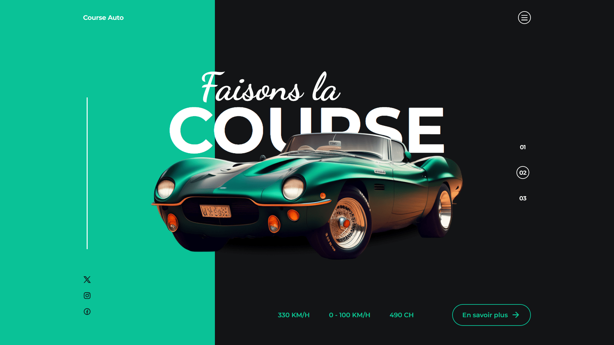

<div align="center">  
  <a href="https://image-slider-car.netlify.app/" target="_blank">  
      
  </a>  
  </br></br>  
  <h3 align="center">🏎️ Slider de Voitures Animé</h3>  
</div>

## <br /> 📌 Sommaire

&nbsp;&nbsp;&nbsp; 🎨 &nbsp; [**Introduction**](#introduction)<br />
&nbsp;&nbsp;&nbsp; 🛠️ &nbsp; [**Technologies**](#technologies)<br />
&nbsp;&nbsp;&nbsp; 🎯 &nbsp; [**Fonctionnalités**](#fonctionnalités)<br />
&nbsp;&nbsp;&nbsp; 🚀 &nbsp; [**Installation**](#installation)<br />

## <br /> <a name="introduction">🎨 Introduction</a>

Slider immersif de voitures de sport réalisé en HTML, CSS et JavaScript avec Swiper.js et GSAP.  
Animations d'entrée dynamiques, navigation fluide, design responsive et structure modulaire.

Parfait pour des landing pages, sites événementiels ou projets créatifs autour de l’automobile et de la vitesse.

## <br /> <a name="technologies">🛠️ Technologies</a>

- HTML5 sémantique
- CSS3 moderne avec variables, media queries et animations
- JavaScript ES6
- [Swiper.js](https://swiperjs.com/) pour le carrousel
- [GSAP](https://gsap.com/) pour les animations d'entrée
- Remix Icons

## <br /> <a name="fonctionnalités">🎯 Fonctionnalités</a>

- Slider full-screen avec transitions en fondu
- Titre animé + image avec GSAP
- Navigation fluide par pagination personnalisée
- Menu responsive avec animation d’ouverture/fermeture
- Interface entièrement responsive
- Design visuel fort basé sur des blocs colorés dynamiques

## <br /> <a name="installation">🚀 Installation</a>

### ✅ Prérequis

- Un navigateur moderne (Chrome conseillé)
- Un éditeur de code (VS Code)

### 📥 Cloner le projet

```bash
git clone https://github.com/ValentinMadiot/img-slider-car_js.git
```

### ▶️ Lancer localement

Il suffit d’ouvrir le fichier index.html dans un navigateur, ou d’utiliser l’extension Live Server sur VS Code.
